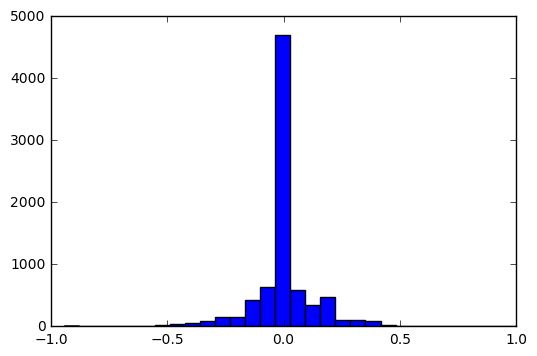
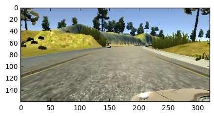
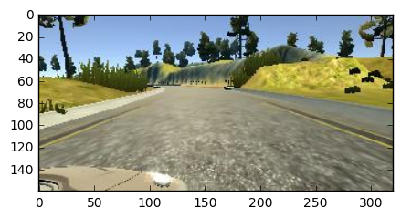
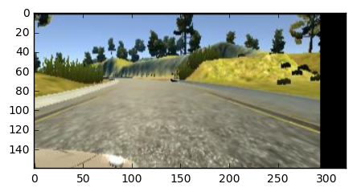
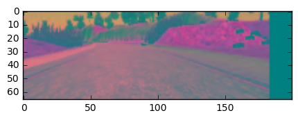
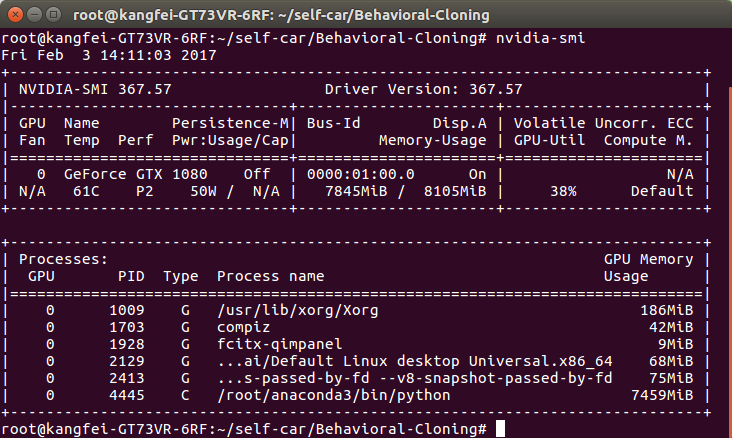

## BehavioralCloning

### Overview

We’ve created a simulator for you based on the Unity engine that uses real game physics to create a close approximation to real driving.

### Dependencies

This project requires **Python 3.5** and the following Python libraries installed:

- [Jupyter](http://jupyter.org/)
- [NumPy](http://www.numpy.org/)
- [SciPy](https://www.scipy.org/)
- [scikit-learn](http://scikit-learn.org/)
- [TensorFlow](http://tensorflow.org)
- [Matplotlib](http://matplotlib.org/)
- [Pandas](http://pandas.pydata.org/) 
- [kersar](http://kersar.org/) 

Run this command at the terminal prompt to install [OpenCV](http://opencv.org/). 

### Files included
- model.py The script used to create and train the model.*
- drive.py The script to drive the car. You can feel free to resubmit the original drive.py or make modifications and submit -- - your modified version.
- model.json The model architecture.
- model.h5 The model weights.

## Model Architecture Design
I studied the NVIDIA neural network for the car model. NVIDIA has used the NVIDIA model for end-to-end self-drive testing, and I made some adjustments to the model to avoid over-fitting and adding non-linearity to improve the prediction.
 
The model is based on the NVIDIA architecture. NVIDIA model is introduced in the course, I am slightly modified the model,
 
I use the Lambda layer to normalize the input image to avoid saturation and make gradients work better. 
I added an extra dropout layer to avoid overfitting. 
I added an ELU activation function for each layer, in addition to the output layer. 
 
I used my own car to train the model, but the total is not successful, then I downloaded the udacity test set, I found that my training set data do not obey the normal distribution, mainly because I use the keyboard to train the car , Rather than the game controller, in the data processing time, I split the data, detailed in the following description.

udacity data is goods.like this:

## Data Preprocessing

### Random selection between left, center, or right image
I used the center image, and the left and right images were also offset by + - 0.2 along some angles
 
<pre><code>
choice =np.random.choice(3)
    if choice==0:
        image = getImageFromTrainPath(left)
        steering=steering_temp+0.2
    elif choice ==1:
        image = getImageFromTrainPath(right)
        steering=steering_temp-0.2
    else:
        image = getImageFromTrainPath(center)
        steering=steering_temp
</pre></code>
### The picture is reversed, the angle also followed reversal
An easy way to get more data is to flip the image around only the horizontal axis, and also to flip the symbol on the angle. We immediately get twice the data, we will not inadvertently bias the model in either direction.
 
normal 

flip 

<pre><code>
if np.random.rand()<0.5:
    image =cv2.flip(image,1)
    steering=-steering
</pre></code>

                
### Change the X and Y translation
Here we move the images in the X and Y directions to generate a fake image. While it is great that we get left and right camera image training to recover, it is very little data. Correspondingly, moving and changing the angle on the X-axis allows us to train for better recovery.
 

<pre><code>
tran_x =100*(np.random.rand()-0.5)
        tran_y =10*(np.random.rand()-0.5)
        steering = steering+tran_x*0.002
        trans_m = np.float32([[1, 0, tran_x], [0, 1, tran_y]])
        height, width = image.shape[:2]
        image = cv2.warpAffine(image, trans_m, (width, height))
</pre></code>

### Image Processing

The purpose of image processing is to remove unnecessary data from the image so that the model focuses on the relevant features while away from the computer vision. 
The image is processed in three steps: 
1, by removing the first 40 pixels of the image (model) because it is useless 
2, adjust the image size 
3, change the image from RGB to YUV (this really helps smooth the image of the model with less information processing)  
The following is the processed image 

<pre><code>
    image = image[30:-25,:,:]
    image = cv2.resize(image,(200,66),cv2.INTER_AREA)
    image = cv2.cvtColor(image,cv2.COLOR_RGB2YUV)
    return image
</pre></code>

### Network Architecture

I  using the NVIDIA network architecture described in the course of this article to get the desired output and modify it numerous times.[paper](http://images.nvidia.com/content/tegra/automotive/images/2016/solutions/pdf/end-to-end-dl-using-px.pdf)
My implementation process is as follows: 
1, from the simulator training data, read the middle of the camera picture and turn angle, 
2. Define the nvidia network model 
3, training model, using the parameters lr = 0.00001, beta_1 =1.0e-4 
4.Save the training results as model.json and save the weights as model.h5 

<pre><code>
    Layer (type)                     Output Shape          Param #     Connected to                     
____________________________________________________________________________________________________
lambda_1 (Lambda)                (None, 66, 200, 3)    0           lambda_input_1[0][0]             
____________________________________________________________________________________________________
convolution2d_1 (Convolution2D)  (None, 62, 196, 24)   1824        lambda_1[0][0]                   
____________________________________________________________________________________________________
maxpooling2d_1 (MaxPooling2D)    (None, 31, 98, 24)    0           convolution2d_1[0][0]            
____________________________________________________________________________________________________
activation_1 (Activation)        (None, 31, 98, 24)    0           maxpooling2d_1[0][0]             
____________________________________________________________________________________________________
convolution2d_2 (Convolution2D)  (None, 27, 94, 36)    21636       activation_1[0][0]               
____________________________________________________________________________________________________
maxpooling2d_2 (MaxPooling2D)    (None, 13, 47, 36)    0           convolution2d_2[0][0]            
____________________________________________________________________________________________________
activation_2 (Activation)        (None, 13, 47, 36)    0           maxpooling2d_2[0][0]             
____________________________________________________________________________________________________
convolution2d_3 (Convolution2D)  (None, 9, 43, 48)     43248       activation_2[0][0]               
____________________________________________________________________________________________________
maxpooling2d_3 (MaxPooling2D)    (None, 5, 22, 48)     0           convolution2d_3[0][0]            
____________________________________________________________________________________________________
activation_3 (Activation)        (None, 5, 22, 48)     0           maxpooling2d_3[0][0]             
____________________________________________________________________________________________________
convolution2d_4 (Convolution2D)  (None, 3, 20, 64)     27712       activation_3[0][0]               
____________________________________________________________________________________________________
activation_4 (Activation)        (None, 3, 20, 64)     0           convolution2d_4[0][0]            
____________________________________________________________________________________________________
convolution2d_5 (Convolution2D)  (None, 1, 18, 64)     36928       activation_4[0][0]               
____________________________________________________________________________________________________
dropout_1 (Dropout)              (None, 1, 18, 64)     0           convolution2d_5[0][0]            
____________________________________________________________________________________________________
activation_5 (Activation)        (None, 1, 18, 64)     0           dropout_1[0][0]                  
____________________________________________________________________________________________________
flatten_1 (Flatten)              (None, 1152)          0           activation_5[0][0]               
____________________________________________________________________________________________________
dense_1 (Dense)                  (None, 100)           115300      flatten_1[0][0]                  
____________________________________________________________________________________________________
dense_2 (Dense)                  (None, 50)            5050        dense_1[0][0]                    
____________________________________________________________________________________________________
dense_3 (Dense)                  (None, 10)            510         dense_2[0][0]                    
____________________________________________________________________________________________________
dense_4 (Dense)                  (None, 1)             11          dense_3[0][0]                    

</pre></code>

### tensorflow gpu
I used the GPU acceleration to train data, using the gtx1080 graphics card, the biggest problem is to install the GPU to accelerate CUDNN, spent 2 days to install the GPU driver

## Training, Validation and Test
I divided the datasets into training sets and validation sets to measure the performance of each period. Use the simulator for testing.

### How to evaluate the model
I use the mean square error of the loss function to measure the approximation of the model for each image to predict a given steering angle.
 
I use Adam optimizer to optimize, learning rate of 1.0e-4. The default value is too large, so that the validation loss stops improving too fast.

##  conclusion
Simulation car can complete the realization of unmanned, will not hit the roadside.