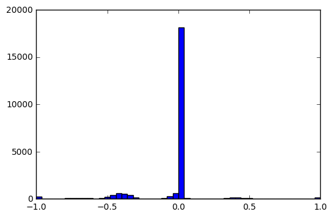
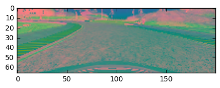

## BehavioralCloning

### Overview

We’ve created a simulator for you based on the Unity engine that uses real game physics to create a close approximation to real driving.

### Dependencies

This project requires **Python 3.5** and the following Python libraries installed:

- [Jupyter](http://jupyter.org/)
- [NumPy](http://www.numpy.org/)
- [SciPy](https://www.scipy.org/)
- [scikit-learn](http://scikit-learn.org/)
- [TensorFlow](http://tensorflow.org)
- [Matplotlib](http://matplotlib.org/)
- [Pandas](http://pandas.pydata.org/) 
- [kersar](http://kersar.org/) 

Run this command at the terminal prompt to install [OpenCV](http://opencv.org/). Useful for image processing:

### Training data 

I first train the data through the simulator and try to train a model. The resulting training angle is as follows:
 

### Image Processing

The purpose of image processing is to remove unnecessary data from the image so that the model focuses on the relevant features while away from the computer vision. 
The image is processed in three steps: 
1, by removing the first 40 pixels of the image (model) because it is useless 
2, adjust the image size 
3, change the image from RGB to YUV (this really helps smooth the image of the model with less information processing)  
The following is the processed image 

### Network Architecture

I  using the NVIDIA network architecture described in the course of this article to get the desired output and modify it numerous times.[paper](http://images.nvidia.com/content/tegra/automotive/images/2016/solutions/pdf/end-to-end-dl-using-px.pdf)
My implementation process is as follows: 
1, from the simulator training data, read the middle of the camera picture and turn angle, 
2. Define the nvidia network model 
3, training model, using the parameters lr = 0.00001, beta_1 = 0.9, beta_2 = 0.999, epsilon = 1e-08, decay = 0.0 
4.Save the training results as model.json and save the weights as model.h5 
